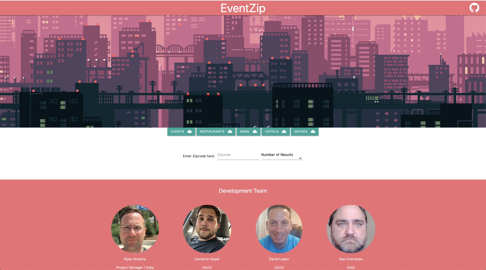
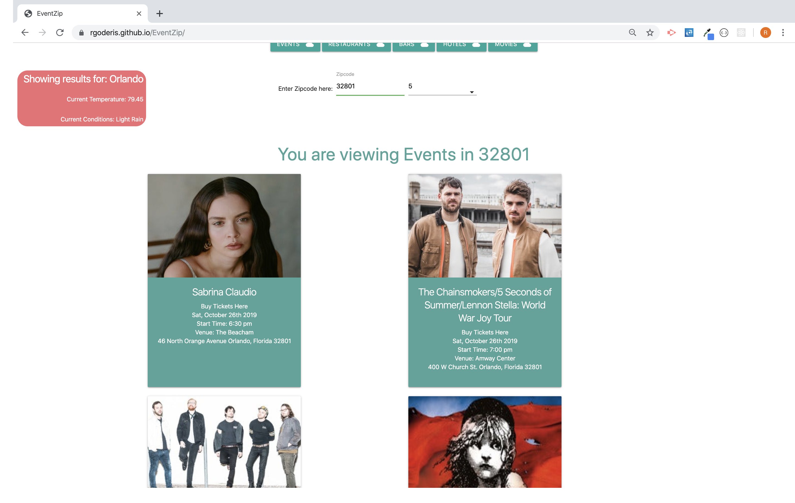
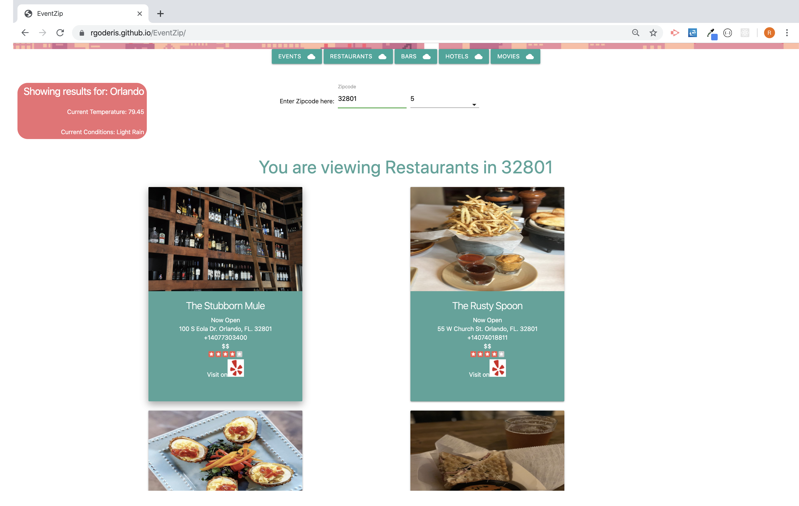
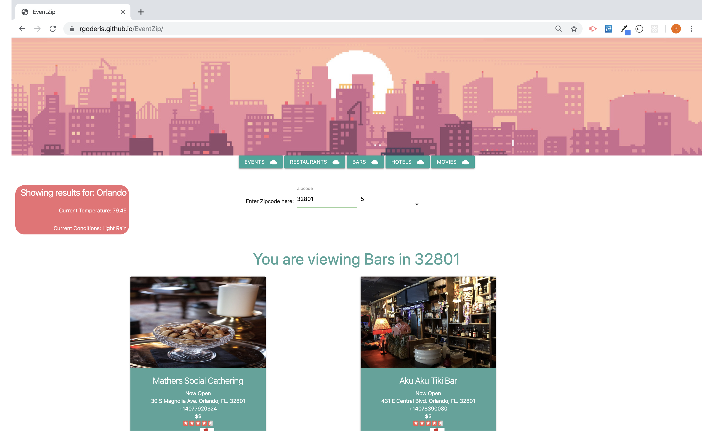
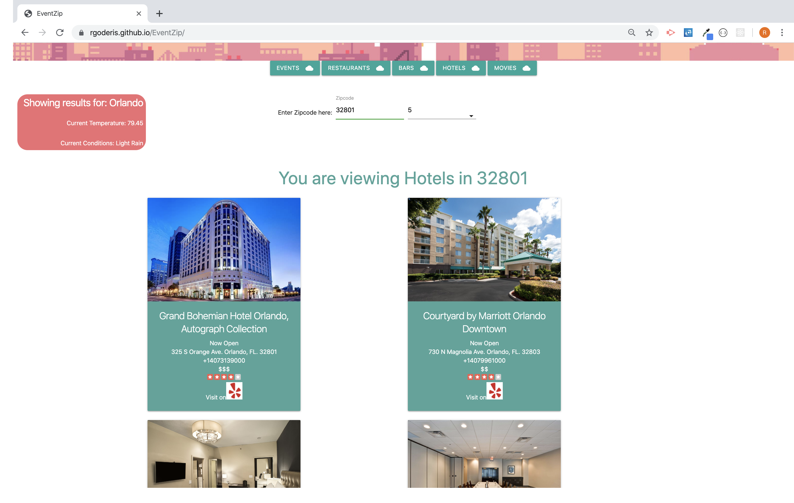

# EventZip

### EventZip pulls and displays event and activity information based on zip code. 
The user enters what area they would like to search via zip code and selects how many results they would like to have displayed.  They then select what type of event or activity they would like to search such as events, restaurant, bars, or hotels.
With the displayed results the user can then choose to buy tickets to the event or visit the Yelp page of the activity by clicking the link.

### APIs utilized 
- Ticketmaster Discovery
- Yelp Fusion
- Open Weather Maps

### Frameworks utilized
- jQuery
- Materialize
- Font Awesome
- Moment.js

### App Team
- Ryan Goderis
- Cameron Kopel
- David Lopez
- Dan Crenshaw

### Events

### Restaurants

### Bars

### Hotels

[EventZip](https://rgoderis.github.io/EventZip/)